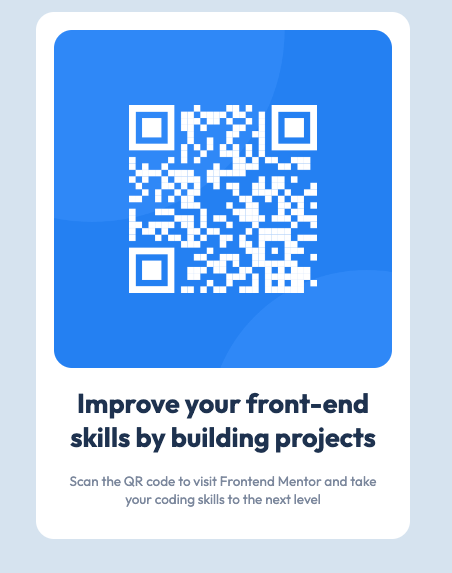

# Frontend Mentor - QR code component solution

This is a solution to the [QR code component challenge on Frontend Mentor](https://www.frontendmentor.io/challenges/qr-code-component-iux_sIO_H). Frontend Mentor challenges help you improve your coding skills by building realistic projects. 

## Table of contents

- [Overview](#overview)
  - [Screenshot](#screenshot)
  - [Links](#links)
- [My process](#my-process)
  - [Built with](#built-with)
  - [What I learned](#what-i-learned)

- [Author](#author)

## Overview
This is the first project in the "Getting Started with Frontend Mentor" learning path.

It's a simple card component

### Screenshot

### Links

- Solution URL: [davham.github.io/fm-qr-component](https://davham.github.io/fm-qr-component)
- Live Site URL: [davham.github.io/fm-qr-component](https://davham.github.io/fm-qr-component)

## My process

### Built with

-  HTML5 markup
-  CSS 

### What I learned

This was a nice project to get away from blindly following tutorials.

Taking a design and coming up with a plan on how I would implement it. As well as finding the resources to find/remind me on the way to impement certain ideas.

## Author

- Website - [David Hamilton](https://davidh.cc)
- Frontend Mentor - [@davham](https://www.frontendmentor.io/profile/davham)
- Twitter(X) - [@davham](https://x.com/davham)

